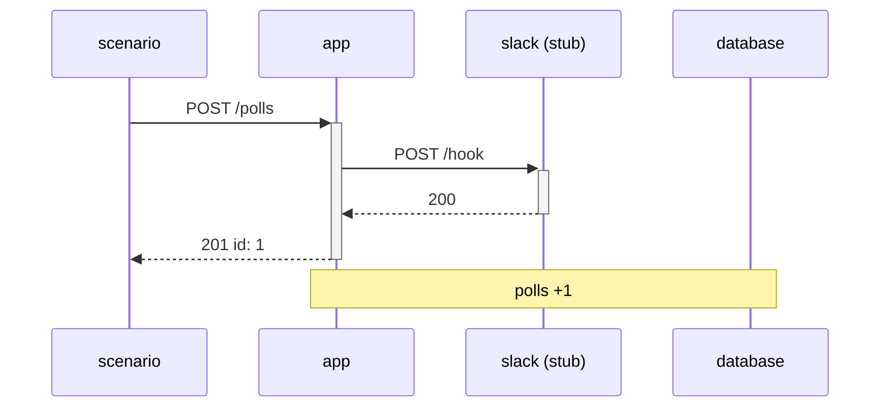

# slicetest

[](https://github.com/revo1290/slicetest/actions/workflows/ci.yml) [](https://www.npmjs.com/package/slicetest) [](LICENSE)

Tests that sit between unit tests and end-to-end tests, for apps written in any language or framework.

slicetest starts your app as a real process, points it at a real Postgres (or MySQL, or SQLite) and at stub servers for the services it calls, and lets you check all three sides in one scenario:

```ts
import { expect } from "vitest";
import { scenario } from "slicetest";

scenario("creating a poll stores it and notifies Slack", async ({ http, db, stub }) => {
  stub("slack").on("POST", "/hook").reply(200, "ok");

  const res = await http.post("/polls", { title: "Dogs or cats?", a: "Dogs", b: "Cats" });

  expect(res).toHaveStatus(201);
  await expect(db).toHaveRow("polls", { title: "Dogs or cats?" });
  expect(stub("slack")).toHaveReceived("POST", "/hook", { json: { text: "New poll: Dogs or cats?" } });
});
```

No browser, no mocked database, no hooks inside your app. The app only has to read its port, database URL and outbound base URLs from environment variables.

## Why

- **Unit tests** mock the database and the network, so broken SQL, migrations and request payloads slip through.
- **End-to-end tests** drive a browser against a deployed stack. They are slow and hard to make deterministic.
- **slicetest** keeps the real HTTP server, the real SQL and the real migrations, and replaces only the things you don't own: third-party APIs. With OpenAPI specs, it also checks that those replacements behave like the real thing.

The database is reset between scenarios with a single `TRUNCATE ... RESTART IDENTITY CASCADE` (about 1.5 ms). The app keeps its connections, so this works with any driver or ORM. Resetting by dropping and re-creating the database takes about 130 ms, and it crashed some apps when their pooled connections were cut.

## Quick start

```sh
npx slicetest init   # detects your stack, writes slicetest.config.yaml and a first scenario
npx slicetest        # starts Postgres, migrates, starts your app, runs scenarios/*.scenario.yaml
```

`init` recognises Node (`npm start`, or Bun, pnpm or Yarn from the lockfile), Deno, Phoenix, Django, FastAPI, Flask, Rails, Laravel, Symfony, plain PHP, Spring Boot, ASP.NET Core, Go and Rust apps; Atlas, Prisma, Alembic, Django, Rails, Laravel, Doctrine, EF Core, Ecto, Drizzle, Knex and plain SQL migrations; and an `openapi.yaml`. If there's a `compose.yaml` / `docker-compose.yml`, its database service sets `db.image` (and `db.engine: mysql` for MySQL or MariaDB), and Redis, Valkey, Mongo, Elasticsearch, MinIO, RabbitMQ and other services with a port become [`containers`](#containers-redis-search-s3-and-other-dependencies), with a reset command where one is known and the usual variable (`REDIS_URL`, `S3_ENDPOINT`, …) passed to the app. A mail catcher there (Mailpit, MailHog, MailDev, smtp4dev, …) or a mail library in the dependencies turns on [`mail`](#mail-catch-what-the-app-sends). SQLite is picked up from Prisma's provider, Rails' `database.yml`, Django's settings or a SQLite driver, with `DATABASE_URL` in the form the framework reads (`file:…`, `sqlite3:…`). And third-party API URLs in `.env.example` (`STRIPE_API_BASE=https://api.stripe.com`) become stubs [recorded from that service](#recording-a-real-service), with the variable pointed at the stub, while local addresses, databases and your own URLs are left alone. Token issuer settings there (`OIDC_ISSUER`, `AUTH0_DOMAIN`, `JWKS_URL`, `JWT_AUDIENCE`, …) turn on [`auth`](#auth-a-real-openid-issuer-tokens-with-any-claims) and point at slicetest's issuer instead of becoming stubs. It lists every guess as a comment in the config so you know what to check.

## What you get that's hard to find elsewhere

- **One scenario, three boundaries.** Assert on the HTTP response, the rows in the real database and the calls to third-party APIs in the same test, in any language the app is written in.
- **`db.changes()`**: a diff of every row the scenario inserted, updated or deleted. `toEqual` on it catches writes you didn't expect.
- **Stubs that can't lie.** Give a stub the provider's OpenAPI spec, and a canned reply the real service would never send fails the test. The run also lists which of the provider's operations the app depends on, flagging deprecated ones.
- **Whole-scenario snapshots.** `expect(await trace()).toMatchSnapshot()` pins the responses, the outbound calls and the database changes in one reviewable file, with dates and UUIDs masked.
- **Record the real service once, replay forever.** Point a stub at the real API with `SLICETEST_RECORD=1`, or import a HAR file saved from the browser, commit the YAML it writes, and later runs are offline and deterministic.
- **OpenAPI coverage** of your own API, per operation and status, across all scenarios, and `slicetest gen --uncovered` to scaffold scenarios for what's missing.
- **Record instead of write.** `npx slicetest record` puts a proxy in front of the app: click through a flow, press Enter, and get a replayable YAML scenario with the stubs' answers, the responses, captured ids and the database changes.
- **Readable in CI.** On GitHub Actions, failing YAML steps are annotated in the pull request on the line that failed, and the job summary shows the OpenAPI coverage table and a sequence diagram of each failed scenario.
- **Diagrams that can't go stale.** `--diagrams docs/flows` writes a Mermaid sequence diagram of every scenario (app, stubs, mail, database), regenerated from what really happened on each run.
- **Races on purpose.** `http.concurrently(10, ...)` and `toHaveStatuses({ 201: 1, 409: 9 })` turn "what if two people click at once" into a test against the real database.
- **Mail as a fourth boundary.** `mail: true` catches the app's SMTP traffic in-process, decoded, with the links pulled out, so a sign-up test can follow the confirmation link.
- **Real token verification, any user.** `auth: true` gives the app an OpenID issuer with a JWKS, so JWT checks stay on in tests, and scenarios mint tokens with any claims, including expired or foreign-signed ones.
- **Webhooks signed like the real sender.** Stripe, GitHub, Slack, Shopify and Standard Webhooks signatures, plus forged and replayed deliveries, so signature checks are tested instead of bypassed.
- **Reproducible chaos.** Stubs can fail the first calls, drop connections or add latency, from a seed the failure output prints, so a resilience test that fails once fails again on demand.
- **GraphQL on both sides.** Stubs answer by operation name and variables rather than by path, and `toHaveGraphQLData()` fails on the `errors` a GraphQL server returns with status 200.
- **Forms as a browser sends them.** `http.submit()` presses a button on a server-rendered page, hidden fields included, so CSRF tokens and Next.js server actions work without knowing their internals.
- **Hard-coded APIs, stubbed anyway.** `hosts: [api.github.com]` catches calls to URLs written in the code or built into a framework, over HTTPS, from Node, Python, Go, Ruby or the JVM, with no change to the app. Redirects to those hosts are followed to the stub, so OAuth logins run end to end.
- **N+1 detection for any stack.** A wire-protocol proxy records the SQL the app runs, so query counts are asserted at the HTTP boundary, whatever the ORM or language.
- **Postgres, MySQL or SQLite**, with the same scenarios and the same helpers on all three, plus Redis, MinIO or any other `containers` reset between scenarios.
- **Fast resets.** `TRUNCATE` between scenarios (about 1.5 ms) with the app still running, and a cached migrated template, so the second run skips container start-up and migrations.

## Install

```sh
npm i -D slicetest vitest
```

You also need Docker or Podman (`npx slicetest doctor` checks). slicetest finds a running Podman machine on its own (on Windows too). Alternatively, pass `db.url` or set `SLICETEST_DATABASE_URL` to use an existing Postgres server, for example a CI service container.

### MySQL

Set `db: { engine: "mysql" }` (or give a `mysql://` URL) and install the driver:

```sh
npm i -D mysql2 @testcontainers/mysql   # the second is only needed without db.url
```

Everything works the same: `mysql:8.4` in a container, a migrated template cloned per worker (tables, foreign keys, views and triggers; stored routines are not copied), a `TRUNCATE` reset that only touches tables that were written to, and `db.*` helpers whose rows look like Postgres's (`BOOLEAN` as `true`/`false`, `BIGINT` ids as numbers, `DATETIME` in UTC). Only the SQL you write yourself differs: `?` placeholders in `db.query` and YAML `sql` steps. `db.schemas` defaults to the database in the URL. `SLICETEST_DATABASE_URL` is only used by projects on the same engine as its scheme, so a CI job can provide one Postgres server while a MySQL project starts its own container.

### SQLite

Set `db: { engine: "sqlite" }`. There's nothing to install and no container: slicetest uses Node's built-in `node:sqlite` (Node.js 22.5 or later), creates the database files in a temporary directory, migrates a template once and gives each worker a copy (`VACUUM INTO`). Point the app at the file:

```ts
slicetest({
  app: { command: "python app.py", env: { PORT: "{{app.port}}", DATABASE_PATH: "{{db.path}}" } },
  db: { engine: "sqlite", migrate: { sql: "schema.sql" } },
});
```

`{{db.url}}` is `sqlite:///absolute/path.db` (the form SQLAlchemy, dj-database-url and many others read) and `{{db.path}}` the plain path. The files are in WAL mode, so the app keeps its connection while slicetest resets tables between scenarios (`DELETE` plus resetting `AUTOINCREMENT` counters, foreign keys off for that moment only). `db.changes()`, `trace()` and every other helper work the same; SQLite has no boolean type, so booleans you insert are stored and read back as `1` / `0`. Migrations with `sql`, `command` or Atlas (`sqlite://` URLs). `db.url`, `db.image` and `SLICETEST_DATABASE_URL` don't apply. With the default `reuse`, the migrated template stays in the system temp directory between runs.

Works on macOS, Linux and Windows. On Windows the app's process tree is stopped with `taskkill /T`, and `app.command` / `db.migrate.command` run through `cmd.exe`.

## Configure

```ts
// vitest.config.ts
import { defineConfig } from "vitest/config";
import { slicetest } from "slicetest/vitest";

export default defineConfig({
  plugins: [
    slicetest({
      app: {
        command: "python server.py", // any language
        env: {
          PORT: "{{app.port}}",
          DATABASE_URL: "{{db.url}}",
          SLACK_WEBHOOK_URL: "{{stub.slack}}/hook",
        },
        ready: { path: "/health" }, // or { log: "listening" }
      },
      db: {
        migrate: { atlas: { dir: "file://migrations" } }, // or { sql: "schema.sql" } / { command: "npm run migrate" }
        seed: "seed.sql", // re-applied after every reset
      },
      stubs: ["slack"],
    }),
  ],
  test: { include: ["scenarios/**/*.test.ts"] },
});
```

### How a run works

1. **Once per run.** slicetest starts `postgres:17-alpine` and migrates a template database. Locally, the container is kept running and the migrated template is cached by the contents of your migrations, so the next run with unchanged migrations skips both steps (see `db.reuse`).
2. **Once per worker.** It clones the template into the worker's own database.
3. **Once per test file.** It starts the stub servers, your `services` and your app.
4. **Before each scenario.** It truncates every table except migration bookkeeping tables (`atlas_schema_revisions`, `_prisma_migrations`, `alembic_version`, `django_migrations`, …) and extension-owned tables such as PostGIS's `spatial_ref_sys`, re-runs the seed, and clears the stubs, cookies and request history. If the app or a service crashed in the previous scenario, it is restarted.
5. **After each scenario.** The scenario fails if the app or a service crashed, the app called a stub route you didn't register, or (with `openapi`) any traffic didn't match the spec.

Database names are unique per run, so several projects or CI jobs can share one Postgres server via `db.url`.

### When a scenario fails

slicetest prints what happened during that scenario, next to Vitest's own error:

```
--- slicetest ---
stub calls with no matching route:
  mail: POST /send
    closest route POST /send: json.to: expected "a@example.com", got "b@example.com"
    registered on mail: POST /send + json conditions

requests to the app:
  POST /signup → 500 (14ms)  {"error":"internal"}

database changes during this scenario:
  users: 1 inserted
    + {"id":1,"email":"a@example.com","verified":false}
  audit_log: 1 updated
    ~ id=7  status: "pending" → "failed"

app output during this scenario:
TypeError: Cannot read properties of undefined (reading 'email')
-----------------
```

For a call no route answered, slicetest names the route it came closest to and the first thing that differed: the method, a path that is off by a trailing slash, letter case or a base-URL prefix (`/api/v1/charges` against `/v1/charges`), a missing header, or the JSON field and value (`json.items.0.sku: expected "a", got "b"`), the GraphQL operation or variables, or a `once()` route that was already used. Only this scenario's app output is shown, not the whole log. The database section is a diff against the state right after the reset and seed, so you see what the app actually wrote. Requests that never got a response (for example because the app crashed) appear as `failed`.

## API

Every scenario receives `{ http, db, stub, app, service }`.

### `http` — talk to the app

```ts
const res = await http.post("/polls", { title: "x" });   // objects are sent as JSON
res.status; res.headers; res.text; res.json; res.durationMs;

await http.get("/polls", { query: { page: 2 }, headers: { accept: "text/html" } });
await http.post("/login", http.form({ user: "a", pass: "b" }));  // urlencoded; FormData, Blob and bytes also work
await http.get("/old-path", { follow: true });                    // redirects are NOT followed by default
await http.submit(await http.get("/signup"), { button: "Sign up", fields: { email: "a@b.test" } }); // a form, as a browser sends it
await http.graphql("query Poll($id: ID!) { poll(id: $id) { title } }", { id: 1 });  // POST /graphql ({ path } for another)

const admin = http.with({ headers: { authorization: `Bearer ${token}` } }); // shares cookies with http
http.cookies.get("session");                                     // cookies persist within a scenario
```

Requests may only go to the app under test; absolute URLs to other hosts are rejected. Defaults for every request can be set with `http: { headers }` in the plugin config. With `follow`, cookies set by each redirect are kept (a login answering `302` with `Set-Cookie`), `303` and `301`/`302` turn into a `GET` as in browsers, and a redirect to another host is returned instead of followed. Cookies follow their `Path` as in browsers.

#### Forms: `http.submit()`

`http.submit(page, opts)` sends a form of a page the app returned, the way a browser with JavaScript off does: every field with its value, the hidden ones included, plus the button that was pressed. So the test doesn't need to know about CSRF tokens (Django, Rails, Laravel) or the action ids and bound arguments of **Next.js server actions** — they are hidden inputs, sent along like a browser sends them.

```ts
const page = await http.get(`/q/${q.id}`);                    // a Next.js page with <button formAction={vote.bind(null, id, "a")}>
const res = await http.submit(page, { button: "Dogs", follow: true });
expect(res.text).toContain("Your choice");

await http.submit(await http.get("/settings"), {
  form: "profile",                                            // by id, name or position, when the page has several
  fields: { name: "Ada", newsletter: true, tags: ["a", "b"] }, // checkboxes and radios by true / false / value
});
```

`button` matches a submit button's text, `value`, `name` or `id`, and picks its form; its `formaction` / `formmethod` / `formenctype` apply. `fields` replace what the page had and must name existing fields, so a typo fails. When nothing matches, the error lists the page's forms and their buttons. In YAML, `submit:` uses the page the previous step requested.

### `db` — arrange and inspect the real database

```ts
await db.insert("users", [{ name: "a" }, { name: "b" }]);          // returns the stored rows
const user = await db.one("users", { email: "a@example.com" });    // throws unless exactly one row
await db.rows("votes", { poll_id: [1, 2], deleted_at: null }, { orderBy: "-id", limit: 10 });
await db.count("votes", { choice: "a" });
await db.sql`SELECT * FROM users WHERE id = ${user.id}`;          // values become bind parameters
await db.query("UPDATE users SET name = $1", ["b"]);
```

In `where`, `null` means `IS NULL` and an array means `IN (...)`.

#### `db.make()` — rows from the schema, not from fixtures

Give only the columns the scenario is about. slicetest reads the table's definition and fills in the rest: a value of each required column's type, the first allowed value for enums and `CHECK (status IN (...))`, and a parent row for every required foreign key, made the same way.

```ts
const order = await db.make("orders", { status: "paid" });   // also creates the customer and the product it references
await db.makeMany("votes", 3, { poll_id: order.poll_id });
await db.makeMany("users", 2, (i) => ({ name: `user ${i}` }));
```

Generated values are numbered per scenario (`title-1`, `orders-2@example.test`, UUIDs, dates from 2026-01-01), so they are unique and identical on every run, which keeps `trace()` snapshots stable. Works the same on Postgres, MySQL and SQLite. When a column needs a value slicetest can't guess (a custom type, a check it can't satisfy), the error names the column to pass.

#### `db.changes()` — assert on everything the app wrote

Instead of guessing which tables to query, ask for the diff. Rows are matched by primary key, so updates show which columns changed:

```ts
await db.insert("users", { email: "a@example.com" });
await db.checkpoint();                                   // ignore what the test itself arranged

await http.post("/users/1/verify");

expect(await db.changes()).toEqual({
  users: { inserted: [], deleted: [], updated: [expect.objectContaining({ changed: ["verified"] })] },
  audit_log: { inserted: [expect.objectContaining({ action: "verify" })], updated: [], deleted: [] },
});
```

`toEqual` fails if the app wrote to a table you didn't list, which catches unexpected side effects. Each entry in `updated` has `key`, `before`, `after` and `changed`. Tables without a primary key report an update as one deleted row plus one inserted row. `bigint` columns (bigserial ids, `count(*)`) come back as numbers when they fit safely.

#### `db.queries()` — the SQL the app ran, from any language

With `db: { queries: true }`, the app's `{{db.url}}` points at a proxy that reads the Postgres or MySQL wire protocol and records every statement the app runs. Nothing changes in the app, and it works the same for an ORM in Node, Python, Ruby, Go or Java. So you can pin down N+1 queries and query counts at the HTTP boundary:

```ts
const queries = await db.queries(() => http.get("/posts"));   // only what ran during the request
expect(queries.repeated()).toEqual([]);                         // no statement shape ran 3+ times
expect(queries.withoutTransactions()).toHaveLength(2);          // ignore BEGIN / COMMIT that some drivers add
```

`repeated(min = 3)` and `shapes()` group statements by shape, with literals and parameters replaced by `?`. `db.queries()` without a function returns the whole scenario so far. The test's own `db` calls aren't included. When a scenario fails, the output lists the SQL the app ran, most frequent first, so an N+1 stands out:

```
SQL the app ran during this scenario (21 statements, most frequent first):
  ×20 SELECT * FROM authors WHERE id = ?
  SELECT * FROM posts ORDER BY id
```

YAML: `expect: { queries: 3 }` on a `request` step fails if the request ran more than 3 statements (not counting transaction control). Connections that switch to TLS are forwarded but not read. SQLite apps open the file directly, so this isn't available for them.

### `stub(name)` — fake the services the app calls

```ts
stub("github").on("GET", "/repos/:owner/:repo").reply((call) => ({ body: { name: call.params.repo } }));

stub("stripe")
  .on("POST", "/v1/charges", {
    query: { expand: "customer" },
    headers: { authorization: /^Bearer / },
    json: { amount: expect.any(Number) },   // subset match; asymmetric matchers and RegExps work anywhere
  })
  .reply(200, { id: "ch_1" });

stub("slack").on("POST", "/hook").once().reply(500);          // first call fails, then falls through…
stub("slack").on("POST", "/hook").reply(200);                 // …to this route: test your retry logic
stub("pay").on("GET", "/status").replySequence([{ status: 503 }, { status: 200 }]);
stub("pay").on("POST", "/charge").delay(5_000).reply(200);    // exercise the app's timeouts
stub("pay").on("POST", "/charge").networkError();             // drop the connection

stub("stripe").on("POST", "/v1/payment_intents", { form: { amount: 2000, metadata: { order: "7" } } }).reply(200, { id: "pi_1" }); // form-encoded bodies
stub("slack").on("POST", "/hook").optional().reply(200);      // may go uncalled, even with strictStubs
stub("slack").calls("POST", "/hook");                         // recorded calls: method, path, params, query, headers, body, json
```

Form-encoded bodies (Stripe, Twilio, OAuth token requests) are parsed into `call.form`, with bracket keys nested the way those providers read them: `metadata[order]=7&items[0][price]=p_1` is `{ metadata: { order: "7" }, items: [{ price: "p_1" }] }`. `form` conditions match a subset of it, and numbers and booleans compare with the strings sent. `multipart/form-data` bodies are read the same way, with each file as `{ filename, type, size, text }` (`text` for text, JSON, XML and CSV files), so `form: { avatar: { filename: "a.png", type: "image/png" } }` checks an upload the app passed on.

Later routes win. `path` may also be a RegExp, and `method` may be `*`. Unanswered calls get a `501` and fail the scenario, with the closest route and why it didn't match (`stub.explain(call)`).

### OpenAPI contracts — for your app and for the services you stub

Point slicetest at OpenAPI 3.0 / 3.1 files and every scenario doubles as a contract test, with no extra assertions:

```ts
slicetest({
  openapi: "openapi.yaml",                                       // your app's spec
  stubs: ["slack", { name: "stripe", openapi: "specs/stripe.yaml" }], // a provider's spec
  // ...
});
```

- **Your app's responses** must be documented (path, method, status) and match the schema.
- **The app's requests to a stub** must match the provider's spec: required query parameters, content type and request body. Spec paths are matched with or without the server's base path (`/v1`).
- **Your stubs' replies** must be something the real service could send. A stub that returns `200 { ok: true }` where the provider documents `202 { messageId }` makes tests pass against an API that doesn't exist; slicetest fails the scenario instead.

```
slicetest: traffic doesn't match the OpenAPI spec:
  app: GET /users/{id} → 200: /id must be integer
  app → mail: POST /mail/send request: body must have required property 'subject'
  stub mail reply (the real service wouldn't answer this way): POST /mail/send responded 200, which specs/mail.yaml doesn't document (documented: 202)
```

At the end of the run, each stub with a spec reports which of the provider's operations the app called across all scenarios: its footprint on that API, for planning an upgrade or a switch of provider. Operations the provider marks `deprecated` are flagged, and on GitHub Actions they become a warning annotation and the list goes to the job summary:

```
slicetest: the app used 3 of 587 operations of stripe (specs/stripe.yaml), 1 deprecated
  POST /v1/charges           ⚠ deprecated
  POST /v1/payment_intents
  GET /v1/customers/{customer}
```

#### `autoReply`: stubs generated from the provider's spec

Add `autoReply: true` to a stub with a spec, and calls that no route matches are answered with the provider's documented example, or with values built from the schema (formats such as `email` and `date-time`, enums, `minimum`, `allOf` are respected). Register routes only for what a scenario cares about; a registered route always wins.

```ts
stubs: [{ name: "stripe", openapi: "specs/stripe.yaml", autoReply: true }],
```

Calls answered this way have `call.fallback === true`. Paths that aren't in the spec still get a 501 and fail the scenario.

At the end of the run, slicetest prints which documented responses your scenarios actually produced, merged across workers and across TypeScript and YAML scenarios:

```
slicetest: OpenAPI coverage (openapi.yaml): 8/9 documented responses (89%)
  GET    /health            200 ✓
  POST   /polls             201 ✓  400 ✓  502 ✓
  GET    /polls/{id}        200 ✓  404 ✗
  POST   /polls/{id}/votes  204 ✓  400 ✓  404 ✓
```

To fail the run below a threshold, use `openapi: { spec: "openapi.yaml", minCoverage: 100 }`. Filtered runs (`-t`, a single file) count too, so you may want `minCoverage: process.env.CI ? 100 : undefined`.

The example apps in `examples/` run every scenario against `examples/openapi.yaml` with `minCoverage: 100`, and their Slack calls against `examples/slack.openapi.yaml`.

#### Streaming replies: `sse()`

LLM APIs stream their answers as Server-Sent Events. `sse(events)` makes such a reply, each event as `[event, data]` or `{ event, data, id }`, data that isn't a string as JSON:

```ts
import { sse } from "slicetest";

stub("anthropic").on("POST", "/v1/messages").reply(sse([
  ["message_start", { type: "message_start", message: { id: "msg_1", type: "message", role: "assistant", content: [], model: "claude-sonnet-4-6", usage: { input_tokens: 5, output_tokens: 1 } } }],
  ["content_block_start", { type: "content_block_start", index: 0, content_block: { type: "text", text: "" } }],
  ["content_block_delta", { type: "content_block_delta", index: 0, delta: { type: "text_delta", text: "Hello" } }],
  ["content_block_stop", { type: "content_block_stop", index: 0 }],
  ["message_delta", { type: "message_delta", delta: { stop_reason: "end_turn" }, usage: { output_tokens: 1 } }],
  ["message_stop", { type: "message_stop" }],
]));
```

In YAML, `reply: { sse: [{ event: message_start, data: { ... } }, ...] }` instead of `body`.

#### GraphQL: stubs that answer an operation

GraphQL APIs (GitHub, Shopify, Linear, Contentful, your own) take every call at one path, so `on("POST", "/graphql")` can't tell them apart. `stub.graphql()` matches the operation instead, whatever the path, for POSTs with `{ query, variables, operationName }` and GETs with those as query parameters. Without `operationName`, the name in the document counts (`query Viewer { ... }`):

```ts
stub("github").graphql("Viewer").data({ viewer: { login: "octocat" } });
stub("github").graphql("CreateIssue", { variables: { title: "Bug" } }).data((call) => ({ createIssue: { issue: { number: 1, title: call.graphql.variables.title } } }));
stub("github").graphql("CreateIssue").once().errors(["rate limited"]);   // { errors: [{ message }] } with status 200, as servers do

expect(stub("github")).toHaveReceivedGraphQL("CreateIssue", { title: "Bug" });   // variables as a subset
expect(await http.graphql(REPORT_BUG, { title: "Bug" })).toHaveGraphQLData({ reportBug: { number: 1 } });
```

`toHaveGraphQLData()` fails on a response with `errors` and prints them, which `toHaveStatus(200)` can't, since GraphQL servers report errors with 200. Unanswered operations fail the scenario named as `GraphQL mutation CreateIssue`. `call.graphql` holds `{ operation, type, query, variables }` for every GraphQL call a stub receives.

In YAML, a stub step takes `graphql: CreateIssue` instead of `on`, `when: { variables }`, and `reply: { data, errors }`; a request takes `graphql: { query, variables }` instead of `json` and fails on `errors` unless `expect.json` names them; a received step takes `graphql:` instead of `call`.

#### Chaos: faults the app must survive

`chaos()` makes a stub misbehave for the rest of the scenario, to test retries, timeouts and fallbacks against the app's real HTTP client:

```ts
stub("payments").on("POST", "/charges").once().reply(201, { id: "ch_1" });
stub("payments").chaos({ failFirst: 2, statuses: [503] });   // 503, 503, then the real answer
await http.post("/orders", { ... });
expect(stub("payments")).toHaveReceivedTimes(3, "POST", "/charges");

stub("search").chaos({ errorRate: 0.3, networkErrorRate: 0.1, latency: [50, 300] });
```

Faulted calls don't use up `once()` / `times()` routes, so a retry gets the answer you registered. 429 and 503 come with `Retry-After: 1`. Random faults are drawn from a seeded generator: a failing scenario prints `chaos on search: …; 4 of 12 calls faulted. Replay with SLICETEST_CHAOS_SEED=1840211`, and running with that variable gives the same faults. `stub.faults()` lists the calls that faulted. YAML: `- chaos: payments` with `failFirst`, `errorRate`, `statuses`, `networkErrorRate`, `latency` and `seed`.

### Hard-coded hosts: `hosts`

Stubs normally take over by giving the app their URL (`{{stub.github}}`) instead of the real one. When the URL is written in the code (`https://api.github.com`), or built into a framework (Spring Security's GitHub login), give the stub the hosts instead:

```yaml
stubs:
  - name: github
    hosts: [github.com]       # OAuth authorize and token endpoints
  - name: github-api
    hosts: [api.github.com]
```

The app is then started with `HTTPS_PROXY` / `HTTP_PROXY` pointing at slicetest and a certificate authority made for the run in the trust settings each runtime reads: `NODE_USE_ENV_PROXY` and `NODE_EXTRA_CA_CERTS` for Node (22.21+ / 24.5+), `SSL_CERT_FILE` / `REQUESTS_CA_BUNDLE` for Python, Ruby, Go and curl, and proxy and trust-store system properties in `JAVA_TOOL_OPTIONS` for the JVM (`HttpURLConnection`, `java.net.http.HttpClient`, Spring's `RestClient` and `RestTemplate`). Calls to those hosts reach the stub with their path and `Host` header, over HTTPS or HTTP; calls to other hosts go to the real ones and are listed in the failure output. Nothing changes in the app. Variables you set in `app.env` win over these, and `{{proxy.url}}`, `{{proxy.ca}}`, `{{proxy.bundle}}` and `{{proxy.truststore}}` are there for clients configured some other way.

`*.connpass.com` covers every subdomain (one stub for `findy.connpass.com`, `mercari.connpass.com`, …); the stub sees the `Host` header, so a reply can depend on it (`{{call.headers.host}}`, or `call.headers.host` in a reply function).

With `offline: true`, the app can only reach localhost and the stubs' hosts. A call anywhere else is refused and fails the scenario with the host's name, so a forgotten stub can't quietly reach a real service, and the first run tells you which hosts to add:

```
slicetest: offline: the app tried to reach api.lu.ma, which no stub answers. Add it to a stub's `hosts` (or remove `offline`).
```

Node apps also get a small preload (`NODE_OPTIONS=--require …`) that gives the proxy settings to `http.Agent`s that libraries make themselves (the Stripe SDK, many API clients), which `NODE_USE_ENV_PROXY` alone doesn't reach. A client in any language that ignores proxy settings altogether goes straight to the real host; `offline` can't stop what doesn't pass through it.

The proxy settings reach every process the app command starts. When that command is a build tool (`gradle bootRun`, `mvn spring-boot:run`, `go run`), its own downloads go through the proxy too, and `offline` refuses them; the failure says so when the host is a package registry. Download dependencies in `app.build` (`./gradlew bootJar`, `mvn package`, which `slicetest init` sets up for Spring Boot), or start a built artifact.

A redirect to an intercepted host is followed to its stub, as a browser would follow it to the real site. So a whole OAuth login runs in a scenario: the stub plays the provider's consent page and sends the browser back.

```yaml
setup:
  - stub: github
    on: GET /login/oauth/authorize
    reply: { status: 302, headers: { location: "{{call.query.redirect_uri}}?code=c1&state={{call.query.state}}" } }
  - stub: github
    on: POST /login/oauth/access_token
    reply: { body: { access_token: gho_test, token_type: bearer } }
  - stub: github-api
    on: GET /user
    reply: { body: { id: 1, login: octocat } }
scenarios:
  - name: log in with GitHub
    steps:
      - request: GET /oauth2/authorization/github
        follow: true                       # → github.com (stub) → back to the app's callback
      - request: GET /api/me
        expect: { json: { login: octocat } }
```

### Recording a real service

A stub can also answer from recordings of the real service, the way VCR or Polly do, except that it works for an app in any language because the stub is a server. Give it the real base URL:

```ts
stubs: [{ name: "github", upstream: "https://api.github.com" }],
```

Record once, with real credentials in the app's environment:

```sh
SLICETEST_RECORD=github npx vitest     # or SLICETEST_RECORD=1 for every stub with an upstream
```

Calls no route matches are forwarded to `upstream` (under its path prefix, headers included) and the answers are written to `recordings/github.yaml` (`recordings:` changes the path). Later runs replay them without touching the network. A request is identified by method, path, query and body (JSON key order doesn't matter); identical requests replay their recordings in the order they were made. Only `content-type`, `location`, `retry-after`, `link` and `etag` response headers are kept, and request headers are never stored, so tokens stay out of the file; bodies are stored as sent, so review the file before committing it.

#### From a HAR file: `npx slicetest import`

No credentials at hand, or the call happens in a flow that's easier to click through? Save the network traffic as HAR (the browser's network panel: "Save all as HAR"; Charles, mitmproxy, Proxyman and Postman export it too) and import it:

```sh
npx slicetest import session.har                       # every stub with an upstream that the HAR has requests for
npx slicetest import session.har --stub stripe --upstream https://api.stripe.com
```

Requests under a stub's `upstream` become entries of its recordings file, in the same format and with the same filtering as recording: only the five response headers above, no request headers, the path relative to the upstream's. Preflights, aborted requests and binary responses are skipped, and the hosts it didn't import are listed. Entries already in the file aren't added twice.

Precedence is: registered route, then recording, then `autoReply`, then a 501 that says how to record the call. Replayed calls have `call.fallback === true`, and are checked against the provider's spec when the stub has one. To refresh recordings, delete the file (or the entries) and record again.

### Matchers

Registered automatically:

```ts
expect(res).toHaveStatus(201);                                   // failure shows the response body
expect(responses).toHaveStatuses({ 201: 1, 409: 9 });            // an array, e.g. from http.concurrently()
expect(stub("slack")).toHaveReceived("POST", "/hook", { json: { text: "hi" } });
expect(stub("slack")).toHaveReceivedTimes(1, "POST", "/hook");
expect(stub("mail")).not.toHaveReceived("POST", "/send");
expect(stub("github")).toHaveReceivedGraphQL("CreateIssue", { title: "Bug" });
expect(await http.graphql(QUERY)).toHaveGraphQLData({ poll: { title: "x" } }); // no errors, data as a subset
await expect(db).toHaveRow("polls", { title: "x" });             // at least one row
await expect(db).toHaveRow("votes", { poll_id: 1 }, 3);          // exactly three
expect(res).toMatchSchema("openapi.yaml#/components/schemas/Poll"); // a response's JSON, or any value; inline schemas too
```

Failure messages list the calls the stub actually received, or the first rows of the table. `toMatchSchema` takes a JSON Schema object or a file with an optional pointer (relative to the working directory; JSON or YAML, OpenAPI 3.0 `nullable` understood, `$ref`s resolved within the file), and lists every mismatch by its JSON path: no OpenAPI setup is needed to check one response's shape.

### Services: workers and other processes

Real apps are rarely one process. Declare the others under `services` and slicetest starts them before the app (in order), watches them like the app, and restarts one that crashed — on the same port, so URLs handed to other processes stay valid:

```ts
slicetest({
  services: {
    pricing: { command: "go run ./cmd/pricing", ready: { path: "/health" } }, // another HTTP service
    worker: { command: "bundle exec sidekiq" },                                 // no port, no ready check
  },
  app: {
    command: "node server.js",
    env: { PORT: "{{app.port}}", DATABASE_URL: "{{db.url}}", PRICING_URL: "{{service.pricing}}" },
  },
});
```

Each service gets `PORT` = `{{service.<name>.port}}` and `DATABASE_URL` unless you pass `env`. A crash fails the scenario, and each service's output during the scenario is part of the failure output.

```ts
scenario("uploading an image queues a thumbnail job", async ({ http, db, service }) => {
  await http.post("/images", { url: "https://example.com/cat.png" });

  await service("worker").waitForLog(/thumbnail \d+ done/);   // this scenario's output only
  await expect(db).toHaveRow("images", { thumbnail_ready: true });
});
```

`waitForLog(pattern, timeout = 5000)` resolves with the matching line and also works on `app`. In YAML: `- log: thumbnail \d+ done` with `from: worker` and `within: <ms>`.

### Containers: Redis, search, S3 and other dependencies

Anything else the app talks to can run as a container next to the database. Each test file gets its own, and `reset` runs inside it before every scenario, like the database's `TRUNCATE`:

```ts
slicetest({
  containers: {
    cache: { image: "redis:7-alpine", port: 6379, reset: ["redis-cli", "FLUSHALL"] },
    s3: { image: "minio/minio", port: 9000, command: ["server", "/data"], env: { MINIO_ROOT_USER: "test", MINIO_ROOT_PASSWORD: "testtest" } },
  },
  app: { command: "node server.js", env: { REDIS_URL: "redis://{{container.cache}}", S3_ENDPOINT: "http://{{container.s3}}" } },
});
```

`{{container.<name>}}` is `host:port`; `.host` and `.port` are there too. The container is ready when its port accepts connections, or when it prints `ready: { log }`. In a scenario, `container("cache").exec(["redis-cli", "GET", "hits"])` runs a command inside it and returns its stdout.

### Races: many requests at once

Double bookings, lost updates and duplicate charges only show up when requests overlap. `http.concurrently(n, send)` prepares `n` requests and releases them together, against the real database, and `toHaveStatuses` checks how they were answered:

```ts
scenario("ten people booking the same seat: one gets it", async ({ http, db }) => {
  const responses = await http.concurrently(10, () => http.post("/bookings", { seat: 7 }));
  expect(responses).toHaveStatuses({ 201: 1, 409: 9 });
  await expect(db).toHaveRow("bookings", { seat: 7 }, 1);
});
```

`send` gets the request's index, for variations. When the counts are off, the failure shows one response per status. In YAML, `concurrency: 10` on a `request` step does the same, with `expect: { statuses: { 201: 1, 409: 9 } }`.

### Mail: catch what the app sends

`mail: true` starts an SMTP server for the app to send to (plain SMTP, no TLS, any username and password accepted). Point the app's mail settings at it, and read what arrived in the scenario, already decoded (encoded subjects, quoted-printable and base64 parts, multipart text and HTML):

```ts
slicetest({
  mail: true,
  app: { command: "node server.js", env: { SMTP_HOST: "{{mail.host}}", SMTP_PORT: "{{mail.port}}" } },
});

scenario("sign-up sends a confirmation link that works", async ({ http, mail }) => {
  await http.post("/signup", { json: { email: "alice@example.com" } });
  const message = await mail.waitFor({ to: "alice@example.com", subject: "Confirm" });
  expect((await http.get(message.links[0]!)).status).toBe(200);
});
```

`mail.messages(filter?)`, `mail.last(filter?)` and `mail.waitFor(filter?, { within })` take `{ to, from, subject, text, html }`: addresses match exactly, other strings as substrings, and RegExps test the value. Each message has `from`, `to` (the envelope, so Cc and Bcc too), `subject`, `text`, `html`, `headers`, `links` and `raw`. The mailbox is emptied before each scenario, what was sent shows up in the failure output and in `trace()`, and `{{mail.url}}` is `smtp://host:port` for libraries that take a URL. No container is involved, so it works the same for apps in any language and on Windows.

### Auth: a real OpenID issuer, tokens with any claims

Apps that verify JWTs are hard to test from the outside: you either disable verification in tests or copy a production token. With `auth: true`, slicetest runs an OpenID Connect issuer for the app, with a discovery document, a JWKS and RS256 keys made for the run, so the app verifies tokens exactly as it does in production. The scenario mints whatever user it needs.

```ts
slicetest({
  auth: { audience: "api://orders", claims: { tenant: "acme" } },   // or just `auth: true`
  app: { command: "...", env: { OIDC_ISSUER: "{{auth.issuer}}", JWKS_URL: "{{auth.jwks}}", OIDC_AUDIENCE: "{{auth.audience}}" } },
});

scenario("admins can delete orders", async ({ http, auth }) => {
  const res = await http.delete("/orders/1", { headers: auth.header({ sub: "alice", roles: ["admin"] }) });
  expect(res).toHaveStatus(204);
});

scenario("the app rejects tokens it must not trust", async ({ http, auth }) => {
  for (const opts of [{ expired: true }, { wrongKey: true }, { audience: "api://other" }, { issuer: "https://evil.example" }]) {
    expect(await http.get("/orders", { headers: auth.header({}, opts) })).toHaveStatus(401);
  }
});
```

`auth.token(claims, opts)` returns the JWT itself. Tokens get `iss`, `aud`, `sub: "user-1"`, `iat`, `nbf`, `exp` (1 hour, or `expiresIn`) and the configured `claims`, all overridable. `auth.rotate()` switches to a new signing key, to check that the app refetches the JWKS. Apps that fetch tokens themselves can use `POST {{auth.issuer}}/token` with the client-credentials grant: `sub` is the client id, and `scope` and `audience` are carried over. No dependencies: keys and signatures come from `node:crypto`.

For libraries that don't take an issuer URL: `{{auth.publicKey}}` is the signing key as a PEM public key, and `auth.jwks` the JWKS document, for a stub to serve at the provider's own URL (see [Clerk](#clerk)).

In YAML, `auth` on a `request` step sends `Authorization: Bearer` with those claims (`auth: true` for the defaults):

```yaml
- request: GET /me
  auth: { sub: alice, roles: [admin] }
  expect: { status: 200 }
```

### Webhooks: deliveries signed like the provider's

`http.webhook()` posts a payload the way Stripe, GitHub, Slack, Shopify or any [Standard Webhooks](https://www.standardwebhooks.com/) sender (Svix, Resend, Clerk, …) delivers it, signed with the secret the app is configured with, so the app's real verification code runs. The signatures are checked against the providers' documented examples.

```ts
const stripe = { provider: "stripe", secret: "whsec_test" } as const;   // the same secret as in app.env

await http.webhook("/webhooks/stripe", { type: "invoice.paid", data: { object: { id: "in_1" } } }, stripe);
await http.webhook("/webhooks/github", { action: "opened" }, { provider: "github", secret: "s", event: "pull_request" });

// Deliveries the app must refuse:
expect(await http.webhook("/webhooks/stripe", event, { ...stripe, invalidSignature: true })).toHaveStatus(400);
expect(await http.webhook("/webhooks/stripe", event, { ...stripe, stale: true })).toHaveStatus(400);   // signed 10 minutes ago
```

Objects are sent as JSON, `URLSearchParams` as a form (Slack slash commands), strings as they are. Other HMAC schemes: `provider: { header: "X-Signature", prefix: "sha256=", encoding: "hex" }`. `signWebhook(body, opts)` returns just the headers. In YAML, add `webhook: { provider, secret, event, stale, invalidSignature }` to a `request` step; its `json`, `form` or `body` is what gets signed.

### Asynchronous side effects

If the app does work in the background (a job queue, a fire-and-forget webhook), wait for the effect with Vitest's own helpers. slicetest doesn't need its own:

```ts
await vi.waitFor(() => expect(stub("mail")).toHaveReceived("POST", "/send"));
await expect.poll(() => db.count("jobs", { status: "done" })).toBe(1);
```

In YAML, add `within: <ms>` to a `db`, `sql`, `received` or `changes` step.

### Snapshot the whole scenario: `trace()`

Because every scenario starts from the same database, ids and rows come out the same on every run. `trace()` returns everything the scenario did at the three boundaries: requests to the app with their responses, calls to each stub with the replies' statuses, and the database changes. Snapshot it, and a change in any of them shows up in review:

```ts
scenario("voting flow", async ({ http, stub, trace }) => {
  stub("slack").on("POST", "/hook").reply(200, "ok");
  const { json } = await http.post("/polls", { title: "Tea or coffee", a: "tea", b: "coffee" });
  await http.post(`/polls/${json.id}/votes`, { choice: "b" });

  expect(await trace()).toMatchSnapshot();
});
```

Dates (`Date` values and ISO strings) become `[date]` and UUIDs `[uuid]`. Mask more with `trace({ keys: ["token"], patterns: [/^tok_/] })`, or use `mask(value, opts)` from `slicetest` on anything else. Update snapshots with `vitest -u`. In YAML, the step is `snapshot: true` (with `mask: [token]`).

The example apps share one snapshot file: the Node and the Python implementation must produce the same trace, byte for byte.

### Sequence diagrams of every scenario

`await diagram()` returns the scenario so far as a [Mermaid](https://mermaid.js.org/) sequence diagram: each request to the app, the stub calls the app made while answering it (GraphQL ones by operation), their replies, the mail it sent and the tables it changed:



- **Living documentation.** `npx slicetest --diagrams docs/flows` (or `SLICETEST_DIAGRAMS=docs/flows` with Vitest) writes one Markdown page per scenario file, with a diagram for each scenario. Commit them, and a pull request that changes how the app talks to the outside world shows it as a diagram diff.
- **Failures on GitHub Actions.** A failing scenario's diagram goes to the job summary, collapsed under its name, next to the error.

### Scenarios

```ts
scenario("name", async ({ http, db, stub, app, service, container, trace, diagram }) => { ... }, timeoutMs?);
scenario.only / scenario.skip / scenario.todo
scenario.each([{ choice: "a", status: 204 }, { choice: "x", status: 400 }])(
  "voting $choice returns $status",
  async ({ choice, status }, { http }) => { ... },
);
```

Scenarios in one file share an app and a database, so they always run one at a time; `.concurrent` is rejected.

### Configuration reference

| Option | Default | |
|---|---|---|
| `app.command` | (required) | Shell command. May use `{{app.port}}` and the other placeholders. |
| `app.build` | none | Shell command run once per run before the app starts, while the database starts, e.g. `npm run build` for `next start`. It gets `app.env`'s literal values (Next.js inlines `NEXT_PUBLIC_*` at build time), not those with placeholders. Not repeated in watch mode. Services take `build` too. |
| `db` | Postgres in a container | Database options (below), or `false` for an app without a database: nothing is started, `{{db.*}}` aren't set and `db.*` in scenarios explains that it's off. `slicetest init` writes `false` when it finds no migrations, no database service and no database library. |
| `app.env` | `{ PORT, DATABASE_URL }` | Values may use `{{app.port}}`, `{{db.url}}`, `{{stub.<name>}}`. For apps that don't take one URL: `{{db.jdbcUrl}}` (`jdbc:postgresql://…`), `{{db.adoNet}}` (an ADO.NET connection string, `Host=…;Port=…;Database=…;Username=…;Password=…`, for .NET's `ConnectionStrings__Default`), `{{db.host}}`, `{{db.port}}`, `{{db.name}}`, `{{db.user}}`, `{{db.password}}`. The rest of `process.env` is inherited. |
| `app.cwd` | vitest root | |
| `app.ready` | `{ path: "/" }` | Poll a path until it answers below 500, or `{ log: "listening" \| /regex/ }`. |
| `app.readyTimeout` | `30000` | |
| `app.scope` | `"file"` | `"worker"`: start the app (and stubs, services) once per Vitest worker and keep it for all of that worker's test files, for apps that start slowly. Sets Vitest's `isolate: false`. |
| `db.engine` | `postgres`, or `mysql` for a `mysql://` URL | `postgres`, `mysql` (see [MySQL](#mysql)) or `sqlite` (see [SQLite](#sqlite)). |
| `db.migrate` | none | `{ atlas: { dir } }`, `{ sql: "file-or-dir" }` or `{ command, inputs?, env? }`. The command gets `DATABASE_URL`, and both it and `env` may use the `{{db.*}}` placeholders, for tools that read other variables: `{ command: "php artisan migrate --force", env: { DB_HOST: "{{db.host}}", DB_DATABASE: "{{db.name}}" } }`, `{ command: "dotnet ef database update --connection \"{{db.adoNet}}\"" }`. |
| `db.seed` | none | SQL file re-run after every reset. |
| `db.schemas` | `["public"]` | Schemas whose tables are reset. |
| `db.keep` | `[]` | Extra tables (`name` or `schema.name`) never truncated. |
| `db.neon` | `false` | For Neon's serverless driver over HTTP: `{{db.url}}` is a Neon-style URL and slicetest answers the driver's queries from the test database ([Neon](#neon-and-vercel-postgres)). |
| `db.queries` | `false` | Point the app at a proxy that records its SQL (Postgres, MySQL), for [`db.queries()`](#dbqueries--the-sql-the-app-ran-from-any-language). |
| `db.url` | `$SLICETEST_DATABASE_URL`, else a container | Use an existing Postgres server (e.g. a CI service container) instead of Testcontainers. |
| `db.image` | `postgres:17-alpine` / `mysql:8.4` | |
| `db.reuse` | on, unless `CI` is set or `db.url` is given | Keep the container between runs and cache the migrated template. The cache key is the migration files' contents; for `{ command }`, list what it reads in `inputs: ["prisma/migrations"]`, or it migrates every run. Databases left by killed runs are dropped after a day. Remove the container (`docker rm -f` / `podman rm -f`) to start clean. |
| `containers` | `{}` | Dependencies as containers: `{ name: { image, port, env?, command?, ready?: { log }, reset? } }`. See [Containers](#containers-redis-search-s3-and-other-dependencies). |
| `mail` | `false` | Start an SMTP server at `{{mail.host}}` / `{{mail.port}}` and collect the app's mail. See [Mail](#mail-catch-what-the-app-sends). |
| `auth` | `false` | `true` or `{ audience, claims }`: an OpenID Connect issuer at `{{auth.issuer}}` (JWKS at `{{auth.jwks}}`) whose tokens scenarios mint with `auth.token()`. See [Auth](#auth-a-real-openid-issuer-tokens-with-any-claims). |
| `services` | `{}` | Other processes: `{ name: { command, env?, cwd?, ready?, readyTimeout? } }`. Without `ready` a service is not waited for. |
| `offline` | `false` | Refuse the app's HTTP(S) calls to hosts no stub intercepts, and fail the scenario naming them. |
| `strictStubs` | `false` | Fail a scenario that registered a stub route the app never called, so a test can't pass without reaching the code it set up for. Exempt a route with `.optional()` (YAML `optional: true`). Unused routes are listed in the failure output either way. |
| `workers` | Vitest's default | Most Vitest workers (`maxWorkers`). Each has its own app and database. |
| `stubs` | `[]` | Names of stubbed services, or `{ name, openapi?, autoReply?, upstream?, recordings?, hosts? }`: check calls against the provider's spec, answer from it, [replay recordings](#recording-a-real-service) of the real service, or answer for [hard-coded hosts](#hard-coded-hosts-hosts). |
| `openapi` | none | The app's OpenAPI 3 spec, or `{ spec, minCoverage }`, or `{ fromApp: "/v3/api-docs" }` for a spec the running app serves (springdoc, FastAPI's `/openapi.json`, NestJS). Every response must match it; the run ends with a coverage report. |
| `http` | `{}` | Default `headers` / `query` for every request. |

The config is validated up front: a missing `app.command`, an ambiguous `db.migrate` or a duplicate stub name fails with a clear message instead of a timeout.

## YAML scenarios

Everything above is also available as data, for teams that don't write JavaScript. Files named `*.scenario.yaml` are picked up automatically, next to your `.test.ts` files, and run with the same app, database and stubs:

```yaml
# yaml-language-server: $schema=https://unpkg.com/slicetest/schema/scenario.schema.json
scenarios:
  - name: creating a poll stores it and notifies Slack
    steps:
      - stub: slack
        on: POST /hook
        reply: { status: 200, body: ok }

      - request: POST /polls
        json: { title: Dogs or cats?, a: Dogs, b: Cats }
        expect:
          status: 201
          json: { id: { $type: number } }
        capture: { pollId: json.id }

      - db: polls
        where: { title: Dogs or cats? }
        expect:
          rows: [{ id: "{{pollId}}", option_a: Dogs }]

      - received: slack
        call: POST /hook
        times: 1
        when:
          json: { text: "New poll: Dogs or cats?" }

      - changes:                  # and nothing else was written
          polls: { inserted: 1 }

  - name: voting {{choice}} returns {{status}}
    each:
      - { choice: a, status: 204 }
      - { choice: x, status: 400 }
    steps:
      - request: POST /polls/1/votes
        json: { choice: "{{choice}}" }
        expect: { status: "{{status}}" }
```

| Step | Keys |
|---|---|
| `stub: <name>` | `on: METHOD /path` (`:params` allowed) or `graphql: <operation>`, `when: { query, headers, json, form, body, variables }`, one of `reply: { status, headers, body }` (`{ data, errors }` for GraphQL) / `sequence: [...]` / `networkError: true`, plus `times`, `delay`. Replies may echo the call: `{{call.params.id}}`, `{{call.json.name}}`, `{{call.form.amount}}`, `{{call.variables.id}}`. |
| `submit: <button>` | `form`, `fields`, `headers`, `follow`, `expect: { status, headers, json, text }`, `capture`. Submits a form of the page the last request returned, like `http.submit()`; `submit: true` presses the form's only button. |
| `request: METHOD /path` | `headers`, `query`, one of `json` / `form` / `multipart` / `body` / `graphql: { query, variables, operationName }`, `expect.schema` (a JSON Schema, or `../openapi.yaml#/components/schemas/Poll` relative to the file), `follow`, `expect: { status, headers, json, text }`, `capture`. `concurrency: n` sends it `n` times at once; `expect` then applies to each response, and `expect.statuses: { 201: 1, 409: 9 }` counts them. |
| `insert: <table>` | `rows`, `capture` (from `row` / `rows`) |
| `request` with `auth` | `auth: true` or the claims: sends a bearer token from the `auth` issuer |
| `request` with `webhook` | `{ provider, secret, event, stale, invalidSignature }`: signs the body like that provider's deliveries |
| `chaos: <stub>` | `failFirst`, `errorRate`, `statuses`, `networkErrorRate`, `latency`, `seed` — like `stub(name).chaos()` |
| `make: <table>` | `rows` (a mapping, or a list for several rows), `count`, `capture` (from `row` / `rows`) — like `db.make()` |
| `db: <table>` | `where`, `orderBy`, `expect: { rows, count }`, `capture` |
| `sql: <query>` | `params`, `expect: { rows, count }`, `capture` |
| `received: <stub>` | `call: METHOD /path` or `graphql: <operation>`, `when`, `times` (exact; default at least once) |
| `log: <regex>` | `from` (a service; default the app), `within` (ms, default 5000). Waits for a matching line printed during the scenario. |
| `changes: { <table>: { inserted, updated, deleted } }` | Each is a count or a list of subset rows (`updated` matches the row after the update). Tables that aren't listed must be unchanged. |
| `checkpoint: true` | Later `changes` steps only see what happens after this step. |
| `set: { name: value }` | Defines variables for later steps, e.g. `{ orderId: "{{$uuid}}", expires: "{{$now+1d}}" }`. |
| `mail: { to, from, subject, text, html }` | `times` (exact; default at least one), `within` (ms, default 5000), `capture` from the last match (`subject`, `text`, `links.0`). Waits for mail the app sends. `{}` matches any message. |
| `use: <definition>` | `with: { param: value }`. Runs the steps of a `define:` entry. |
| `snapshot: true` | The scenario's [trace](#snapshot-the-whole-scenario-trace) so far must match its stored snapshot. `mask: [keys]` hides more values. |

`db`, `sql`, `received` and `changes` steps take `within: <ms>` to retry until they pass, for effects the app applies asynchronously.

- `multipart:` sends `multipart/form-data`: plain values are fields, `{ file: fixtures/avatar.png }` uploads a file (relative to the scenario file, content type from its extension, or `type` / `filename`), `{ content: ..., filename: notes.json }` an inline one, and a list sends a field several times.
- `request:` also takes a captured URL of the app, e.g. `GET {{link}}` after capturing a link from a mail.
- `{{name}}` inserts a captured value or an `each` field. A string that is only `{{name}}` keeps the value's type, so `id: "{{pollId}}"` compares as a number.
- Built-ins: `{{$uuid}}` (a new one each time), `{{$seq}}` (1, 2, 3… per scenario, the same on every run), `{{$now}}` (ISO time), `{{$today}}` (`YYYY-MM-DD`, UTC), `{{$timestamp}}` (Unix seconds) and `{{$timestampMs}}`; the time ones take an offset: `{{$now+7d}}`, `{{$timestamp-30m}}` (`ms`, `s`, `m`, `h`, `d`). `{{env.NAME}}` reads an environment variable, for tokens a CI job provides. In a stub's reply they're evaluated per call, so `id: "ch_{{$seq}}"` gives each call its own id.
- Expected `json`, `rows` and `headers` are subsets: extra keys are fine. Values match loosely with:

  | Matcher | Matches |
  |---|---|
  | `{ $type: number }` | `string`, `number`, `integer`, `boolean`, `array`, `object`, `null` |
  | `{ $regex: "^ch_" }` | a string the pattern finds |
  | `{ $contains: "ok" }` | a string with that substring, or a list with a matching item (`{ $contains: { sku: a } }`) |
  | `{ $gte: 1, $lt: 10 }` | numbers, or strings such as ISO dates (`{ $gte: "2026-01-01" }`); also `$gt`, `$lte` |
  | `{ $len: 3 }` | a string or list of that length; `{ $len: { $gte: 1 } }` |
  | `{ $oneOf: [paid, pending] }` | any of the values (or matchers) |
  | `{ $not: "" }` | anything the value or matcher doesn't match |
  | `{ $format: uuid }` | `uuid`, `email`, `date`, `date-time`, `uri`, `integer` (a string of digits) |
  | `{ $any: true }` | anything but `null` / missing |

  Several `$` keys in one mapping must all hold.
- A file-level `setup:` list runs at the start of every scenario. `skip`, `only` and `timeout` work per scenario.
- A file-level `define:` names step lists that `use:` steps run, like functions: `params` are given with `with:` and are `{{variables}}` inside, and what the steps capture is visible after the `use` (see below).
- Mistakes are reported with the file and line before anything runs (`polls.scenario.yaml:12: unknown key "stauts" in expect`). A failing step reports its file, line and step number. The JSON Schema in `schema/` gives editors completion and inline errors.

### Reusing steps: `define` and `use`

```yaml
define:
  signed up:
    params: [email]
    steps:
      - request: POST /signup
        json: { email: "{{email}}", password: hunter22 }
        expect: { status: 201 }
        capture: { userId: json.id }
      - request: POST /login
        json: { email: "{{email}}", password: hunter22 }
        capture: { token: json.token }

scenarios:
  - name: a new user has an empty cart
    steps:
      - use: signed up
        with: { email: ada@example.com }
      - request: GET /users/{{userId}}/cart
        headers: { authorization: "Bearer {{token}}" }
        expect: { json: { items: [] } }
```

A definition is a list of steps, or `{ params, steps }`, and may `use` other definitions. Unknown names, missing or extra `with` keys and definitions that use themselves are reported with their line before anything runs. A failing step inside one names the whole path: `cart.scenario.yaml:5 (a new user has an empty cart, step 1: use signed up → step 2: POST /login)`.

### Without any JavaScript: `npx slicetest`

Put the plugin options in `slicetest.config.yaml` and run the CLI. It needs Node, but no `package.json` scripts, TypeScript or Vitest config. To add TypeScript scenarios later, `slicetest()` without options in a `vitest.config.ts` reads the same file (`slicetest("path/to/config.yaml")` for another one):

```yaml
# slicetest.config.yaml
app:
  command: python server.py
  env: { PORT: "{{app.port}}", DATABASE_URL: "{{db.url}}", SLACK_WEBHOOK_URL: "{{stub.slack}}/hook" }
  ready: { path: /health }
db:
  migrate: { command: alembic upgrade head }
stubs: [slack]
```

```sh
npx slicetest                 # every *.scenario.yaml under the config's directory
npx slicetest polls -t voting # filter by file and scenario name
npx slicetest --watch
```

### Scenarios from your OpenAPI spec: `npx slicetest gen`

```sh
npx slicetest gen                 # uses `openapi` from slicetest.config.yaml, or --spec openapi.yaml
npx slicetest gen --uncovered     # only the documented responses the last run didn't produce
```

writes `scenarios/<resource>.gen.scenario.yaml` with one scenario per documented response. Requests are built from the spec's examples and schemas. A path that needs an id gets a step that creates the resource first through the collection's `POST` and captures its id. A 404 on a made-up id and a 400/422 on an empty body are runnable as is; other responses are generated as `skip: true` scenarios marked TODO, so the skipped list in the test output is what's left to cover. Existing files are kept unless you pass `--force`.

Operations that the spec protects with a bearer token (`http: bearer`, `oauth2` or `openIdConnect` security) get `auth:` on their requests, with the scopes the spec requires in the token's `scope` claim, and their 401 responses become runnable scenarios that send no token. With [`auth`](#auth-a-real-openid-issuer-tokens-with-any-claims) in the config, the generated scenarios run against the app's real token checks.

`--uncovered` reads the coverage the last run left in `node_modules/.cache/slicetest/`, which closes the loop: run, look at the ✗ in the coverage table, `gen --uncovered`, fill in the TODOs.

### Record a scenario by using the app: `npx slicetest record`

The fastest way to a first scenario is to do the thing once. `record` starts the database, the stubs and the app exactly as a test run would, plus a proxy in front of the app:

```
$ npx slicetest record
Recording. Use the app through http://127.0.0.1:52301 (it forwards to http://127.0.0.1:52288).
Everything it does is captured: responses, calls to stubs, database changes.
Press Enter (or Ctrl+C) to finish and write the scenario.

Wrote scenarios/recorded-20261001-091500.scenario.yaml: 3 request(s), 1 stub route(s), changes in polls, votes.
Replay it with: npx slicetest scenarios/recorded-20261001-091500.scenario.yaml
```

Point a browser, curl, Postman or a mobile build at the proxy URL and go through the flow. The scenario it writes has:

- a `stub` step for every answer a stubbed service gave (from `autoReply`, or a real service with `upstream` and `SLICETEST_RECORD`), so the replay needs neither;
- a `request` step per request with the status and body to expect, where dates and UUIDs only have to be strings, and a `capture` for any value that a later request reuses (`POST /orders` → `GET /orders/{{id}}`);
- `received` steps for the calls the app made to stubs, and a closing `changes` step with the rows written per table.

Requests for scripts, styles and images are left out. The file starts with a comment of what to review: it is a starting point, and the assertions that matter to you are yours to tighten. `--out` names the file, `--port` fixes the proxy's port.

### On GitHub Actions

Nothing to configure. When `GITHUB_ACTIONS` is set, a failing YAML step is annotated on its own line of the `.scenario.yaml` file in the pull request (Vitest already does this for TypeScript tests), and the job summary gets a table of the failed steps and the OpenAPI coverage table, with ✅ / ❌ per documented response. A coverage below `minCoverage` is annotated on the spec file.

### Is everything in place? `npx slicetest doctor`

Checks what a run needs before it starts, instead of failing with a timeout halfway: the config, the container runtime (or the database server at `db.url` / `SLICETEST_DATABASE_URL`, with the password hidden), the migrations, seed and working directories, the `atlas` CLI, `mysql2` for MySQL, the programs the app and services start, the OpenAPI files and missing recordings. Each problem says what to do, and the exit code is 1 when something must be fixed, so it also works as the first step of a CI job.

```
  ✓ Node.js 24.13.0
  ✓ config slicetest.config.yaml
  ✗ no container runtime
      Could not find a working container runtime strategy. Start Docker or a Podman machine (`podman machine start`), or set SLICETEST_DATABASE_URL / db.url to an existing database server
  ✓ migrations migrations
  ! stub github: no recordings yet (recordings/github.yaml)
      run once with SLICETEST_RECORD=github to record https://api.github.com

1 problem(s) to fix before running.
```

## Neon and Vercel Postgres

Apps on Neon's serverless driver (`neon()` from `@neondatabase/serverless`, `drizzle-orm/neon-http`, `@vercel/postgres`'s `sql`) send each query over HTTPS to Neon, not to a Postgres port. With `db: { neon: true }`, `{{db.url}}` is a Neon-style connection string, and slicetest answers the driver's HTTP queries (single statements and `transaction()` batches) from the test database. The driver, its type parsing and its errors (with Postgres's `code`) are the real ones; `db.queries` sees the SQL. `slicetest init` sets it when the driver is a dependency. The driver's WebSocket mode (`Pool`, `Client`) isn't covered.

With Drizzle, `drizzle-kit push` and `migrate` connect through the project's driver; with only Neon's installed, they try a WebSocket a local server doesn't answer, and exit 0 anyway (slicetest stops when a migration leaves the database without tables). Generate the SQL instead (`npx drizzle-kit generate`) and let slicetest apply it: `migrate: { sql: db/migrations }`, which `slicetest init` reads from `drizzle.config`'s `out`.

## Clerk

Clerk verifies session tokens with keys from its Backend API, and reads users from it. Both are stubbed, and the tokens come from slicetest's issuer, so requests run as any user, with no Clerk account:

```yaml
# slicetest.config.yaml (what `slicetest init` writes when @clerk/nextjs is a dependency)
app:
  env:
    NEXT_PUBLIC_CLERK_PUBLISHABLE_KEY: pk_test_Y2xlcmsuc2xpY2V0ZXN0LnRlc3Qk   # base64 of "clerk.slicetest.test$"
    CLERK_SECRET_KEY: sk_test_slicetest
auth: true
stubs:
  - name: clerk
    hosts: [api.clerk.com, clerk.slicetest.test]
```

```ts
function signIn({ auth, stub }: ScenarioContext, id = "user_1", email = "ada@example.com") {
  stub("clerk").on("GET", "/v1/jwks").reply(200, auth.jwks);   // the keys Clerk verifies tokens with
  stub("clerk").on("GET", `/v1/users/${id}`).reply(200, {
    object: "user", id, first_name: "Ada", last_name: null, primary_email_address_id: "e1",
    email_addresses: [{ object: "email_address", id: "e1", email_address: email, verification: { status: "verified" }, linked_to: [] }],
    phone_numbers: [], web3_wallets: [], external_accounts: [], created_at: 0, updated_at: 0,
  });
  return auth.header({ sub: id, sid: "sess_1" });
}

scenario("checkout as a signed-in user", async (ctx) => {
  const res = await ctx.http.post("/api/checkout", undefined, { headers: signIn(ctx) });
  expect(res).toHaveStatus(200);
});
```

`CLERK_JWT_KEY` with `{{auth.publicKey}}` would avoid the JWKS stub, but Next.js inlines environment variables into middleware at build time, before the key exists. Without a token, `auth.protect()` in middleware answers API routes with 404.

## Spring Boot and other JVM apps

`slicetest init` recognizes Spring Boot (Gradle or Maven, also in a `backend/` folder) and writes:

```yaml
app:
  cwd: backend
  build: ./gradlew bootJar -q      # built once: workers don't compile at once, bootRun downloads nothing
  command: ./gradlew bootRun -q
  env:
    SERVER_PORT: "{{app.port}}"
    SPRING_DATASOURCE_URL: "{{db.jdbcUrl}}"       # overrides application.yml
    SPRING_DATASOURCE_USERNAME: "{{db.user}}"
    SPRING_DATASOURCE_PASSWORD: "{{db.password}}"
  ready: { path: /actuator/health }
  readyTimeout: 120000
  scope: worker                    # one JVM per worker, kept for all of its test files
workers: 2
```

Starting a JVM takes seconds, so by default (`scope: file`, one app per test file) the start-up dominates: 8 test files took 28 s on a Spring Boot 4 app. With `scope: worker` the app is started once per Vitest worker and kept for every file that worker runs, and `workers` caps how many there are: 18 s with the default worker count, 10 s with 2, 8 s with 1. Scenarios stay independent, since the database, stubs and cookies are reset between them either way; what's shared is the app process (and its in-memory state, such as caches).

Springdoc serves the spec at `/v3/api-docs`: `openapi: { fromApp: /v3/api-docs }` checks every response against it and reports its coverage, without a spec file in the repository. Generated specs often miss error responses and nullable fields, which this makes visible.

Apps that run Hibernate with `ddl-auto: validate` against schema-owning migrations (Atlas, or a migration command) work as they are: slicetest migrates, Hibernate validates the result at start-up. For a faster start, build a jar once with `build: ./gradlew bootJar -q` and run `command: java -jar build/libs/app.jar`. Calls to hard-coded hosts (GitHub, Google, …) are caught with [`hosts`](#hard-coded-hosts-hosts).

## Next.js

Nothing Next-specific is needed beyond two settings. `slicetest init` writes both when `package.json` has `build` and `start` scripts:

```yaml
app:
  build: npm run build   # `next start` serves the last build; without this, scenarios can pass against old code
  command: npm start     # next start reads $PORT
  env: { PORT: "{{app.port}}", DATABASE_URL: "{{db.url}}" }
```

- **Server actions** are ordinary form posts when JavaScript is off. Request the page, then `submit:` the button; the action id and bound arguments travel in hidden inputs, so scenarios keep working when a build changes the ids.
- **Route handlers and pages** are plain HTTP: `request: GET /api/...` and `text: { $contains: ... }`. React may put `<!-- -->` between adjacent text nodes, so match on a word rather than on `75%` built from two values.
- **Rows inserted by migrations** (seed data in an Atlas or Prisma migration) are truncated before every scenario, like everything else. Create what a scenario needs with `make`, or move shared rows to `db.seed`.

## Examples

`examples/` has a Node app (`node:http` + `pg`) and a Python app (`http.server` + `psycopg`) with the same API. **The same scenario files (`polls.test.ts` and `polls.scenario.yaml`) run against both**:

```sh
npm test            # unit tests + both example apps
npm run test:dist   # the built package, and the CLI with examples/slicetest.config.yaml
```

## Using a coding agent

[`.claude/skills/slicetest-write-tests`](.claude/skills/slicetest-write-tests/SKILL.md) teaches Claude Code (or any agent that reads skills) how to write slicetest scenarios. Copy it into your project's `.claude/skills/`. Contributors: see [`AGENTS.md`](AGENTS.md).

## Status

Early. Postgres, MySQL and SQLite. CI runs on Linux and Windows.
